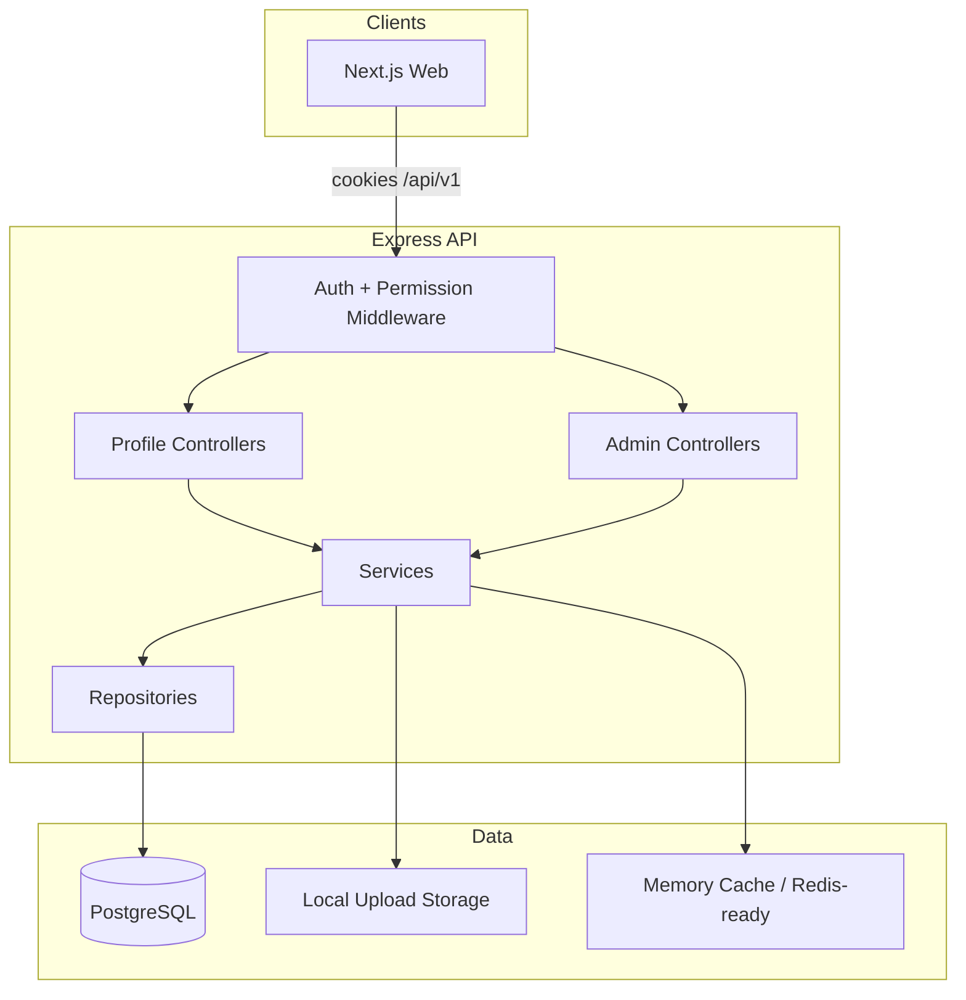

# Architecture — Phase 2

## Layers

1. **Routes** — versioned REST under `/api/v1`
2. **Controllers** — HTTP adapters only
3. **Services** — business rules, audit/activity side effects
4. **Repositories** — Prisma data access
5. **Abstractions infra** — `storage` (local→S3 later), `cache` (memory→Redis later), `notificationService` (DB only)

## Security

- Every admin route: `authenticate` → `requireAdminAccess` → `requirePermission(...)`
- Soft delete only (`deletedAt` + `ARCHIVED`)
- Ownership checks on profile/session mutations
- Admin actions write `AuditLog` + `ActivityLog`
