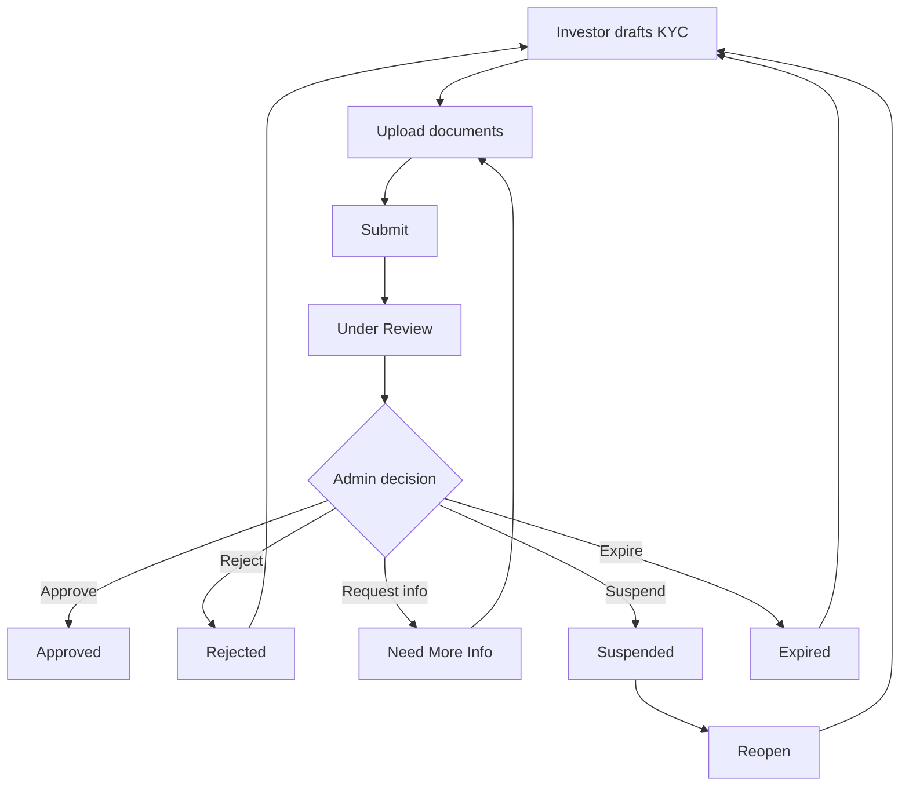

# KYC Flow Documentation

## Investor path

1. `PATCH /kyc/update` — personal/ID details (creates PENDING draft)
2. `POST /kyc/upload` — FRONT/BACK/SELFIE (or other types)
3. `POST /kyc/submit` — validates required docs, ages, lock → `UNDER_REVIEW`
4. Receive DB notification on outcomes

While `SUBMITTED` / `UNDER_REVIEW`, uploads and re-submit are locked.

## Admin path

1. Queue via `GET /admin/kyc` (search/filter/sort)
2. Open `GET /admin/kyc/:id` (documents with signed download URLs)
3. Decide: approve / reject / request-information / expire / reopen / suspend
4. Each decision writes: `KycReview`, `KycHistory`, `AuditLog`, `ActivityLog`, notification

## Security

- KYC files not publicly served under `/uploads/kyc`
- Signed HMAC download URLs (short TTL)
- Ownership checks on investor document delete
- Permission checks on all admin review endpoints
- Duplicate detection via SHA-256 checksum
- Virus scan interface prepared (`NoopVirusScanner`)
